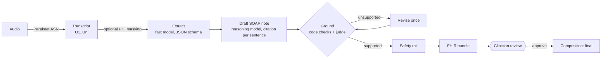
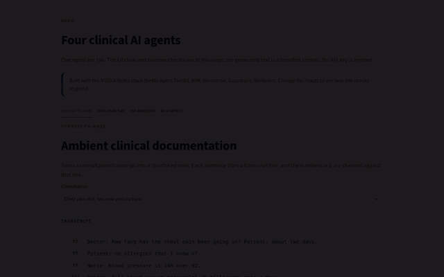
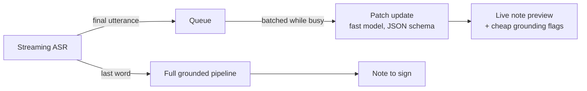

# consult-to-note

**Grounded clinical notes from doctor-patient conversations.** A consultation goes in; a SOAP note comes out
in which every sentence cites the transcript lines it came from. Code checks what code can check (numbers,
negation, left and right), a model judges the rest, unsupported sentences are repaired once, and a clinician
approves before the note is exported as a FHIR R4 document. The same pipeline also runs live, updating the
note while the consultation is still going within a one-second latency budget.

Built on open models served through OpenAI-compatible endpoints (NVIDIA NIM with Nemotron by default), so
the same code runs against a hosted API during development and on a hospital's own GPUs in production.



## Demo



Two consultations in the interactive demo. For each, the note is generated with its numbers checked against the transcript lines it cites; then an error is planted (250 mg instead of 25 mg, 25 units instead of 2.5 units) and the check flags the sentence. The video is on [anhduongvo.github.io](https://anhduongvo.github.io/projects/clinical-agentic-ai/).

## Why this design

- **Citations at generation time, not afterwards.** The model points to its evidence (`[U12, U14]`) while it
  writes, so verification is a cheap check of a pointer rather than a search for a source.
- **Code before models.** Numbers, units, negation and laterality are compared deterministically. Only
  sentences that code cannot clearly pass go to an LLM judge.
- **Two model tiers.** A fast model extracts structured facts and judges; a reasoning model drafts and
  repairs. Reasoning is switched off where it only adds latency.
- **Structured output everywhere.** Extraction, notes and verdicts are generated against JSON schemas
  (`guided_json`), validated with Pydantic, and retried once with the schema in the prompt.
- **Clinician approval.** The LangGraph run pauses before finalising; the FHIR Composition is `preliminary` until a
  clinician approves it.

## Quick start

No GPU needed. Python 3.11 to 3.13.

```bash
python -m venv .venv && source .venv/bin/activate
pip install -e ".[dev]"
cp .env.example .env            # add an API key, e.g. from https://build.nvidia.com
c2n models                      # list the model IDs your key can use
c2n demo --no-trials            # synthetic diabetes follow-up, end to end
pytest                          # offline tests: scripted model responses, mocked HTTP
```

Outputs land in `runs/demo/`: `note.md` (with citations and flags), `note.json`, `grounding.json`,
`fhir_bundle.json` and `profile.json` (seconds and tokens per step).

Your own transcript (lines starting with `[doctor]` / `[patient]` or `Doctor:` / `Patient:`):

```bash
c2n note my_consult.txt                         # pauses for clinician approval, then finalises
c2n note my_consult.txt --no-review --deidentify --safety --trials --trial-location Switzerland
```

## Features

| Area | What it does | Where |
| --- | --- | --- |
| Note pipeline | Extract, draft with citations, ground, revise, safety check, FHIR, review | `agent/graph.py` |
| Grounding | Lexical support with number, unit, negation and laterality checks; LLM judge for the rest | `grounding.py` |
| Speech | Parakeet ASR through Riva: chunking, word boosting for drug names, diarisation or per-speaker channels | `asr.py` |
| Privacy | PHI masking on input (NeMo Guardrails with Presidio), output self-check | `guard.py`, `guardrails_config/` |
| Interoperability | FHIR R4 document bundle: Composition with LOINC section codes, Patient, Practitioner, Conditions, medications, observations, allergies | `fhir.py` |
| Trials | Optional pre-screen against recruiting studies on ClinicalTrials.gov | `trials.py` |
| Evaluation | ACI-Bench: ROUGE, support rate, judged omissions and hallucinations, latency and tokens | `evaluation.py` |
| Live mode | Note updates during the consultation within a latency budget | `realtime/` |
| Serving benchmarks | Hosted vs self-hosted NIM vs Dynamo: TTFT, latency percentiles, throughput, cost | `realtime/bench/`, `deploy/` |
| Agent tooling | NeMo Agent Toolkit plugin: `nat run`, `nat eval` with profiler, `nat serve`, `nat mcp serve` | `nat_plugin/`, `configs/` |

## Speech to text

```bash
pip install -e ".[asr]"
c2n transcribe consult.wav --boost "empagliflozin,ramipril,metformin"
c2n transcribe doctor.wav --patient-audio patient.wav       # one channel per speaker: exact roles
c2n note runs/transcript.json
```

Input is 16-bit PCM WAV, ideally mono 16 kHz; long files are split into 25-second chunks. With one mixed
recording the code uses diarisation when the endpoint returns speaker tags and otherwise asks the fast model
to label doctor and patient. For German or French, point `C2N_ASR_FUNCTION_ID` at the multilingual Parakeet
model and set `C2N_ASR_LANGUAGE` (see `.env.example`).

Real audio for testing: PriMock57, 57 mock GP consultations with separate doctor and patient channels
(`python scripts/download_data.py --primock`, needs git-lfs).

## Live mode

The note updates while the consultation is running. The model returns small patch operations instead
of rewriting the note, because output tokens dominate latency.



| Technique | Effect |
| --- | --- |
| Incremental patches instead of rewrites | Fewer output tokens per update |
| Batching under load | Utterances that arrive during an update go into the next one, so the scribe never falls behind |
| Latency-aware routing | Best model whose recent latency fits the budget, otherwise the fastest; failures count as slow |
| Two-tier quality | The live note is a preview; the full grounded pipeline produces the note the clinician signs |

```bash
c2n live --transcript src/consult_to_note/samples/diabetes_followup.txt     # replay at speaking pace
pip install -e ".[asr]" && c2n live --wav consult.wav                      # streaming ASR
pip install -e ".[mic]" && c2n live --mic                                   # microphone
```

Options: `--budget 0.8`, `--models "<best>,<fastest>"`, `--no-final`. Results in `runs/live/`:
`summary.json` (p50 and p95 speech-to-note latency, share within budget, models used), `updates.json`,
`live_note.md`, `final_note.md`, `fhir_bundle.json`.

## Self-hosting and benchmarking

The same model can be served three ways; `c2n bench` measures them with realistic prompt lengths drawn from
ACI-Bench dialogues.

```bash
# NIM container on your own GPU (needs an NGC key, Docker and the NVIDIA Container Toolkit)
docker compose -f deploy/nim/docker-compose.yml up -d nemotron
curl localhost:8000/v1/models

# NVIDIA Dynamo, aggregated (one GPU) or disaggregated prefill and decode (two GPUs)
bash deploy/dynamo/aggregated.sh
bash deploy/dynamo/disaggregated.sh

# Benchmark and plot
cp deploy/targets.example.yml deploy/targets.yml   # URLs, model names, GPU price per hour
c2n bench deploy/targets.yml
c2n plot runs/bench/<timestamp>/summary.json       # TTFT p95, end-to-end p95, throughput
c2n aiperf --url http://localhost:8000             # equivalent commands for NVIDIA AIPerf
```

Reported per target and concurrency: TTFT, inter-token latency (when the server reports usage), end-to-end
latency at p50 and p95, output tokens per second, and cost per 1,000 notes from the GPU price. Two workloads:
`note_update` (live path, short prompts and outputs) and `full_note` (batch path).

## Evaluation

```bash
python scripts/download_data.py          # ACI-Bench, about 1 MB of CSV
c2n eval --split valid --n 10
```

| Metric | Meaning |
| --- | --- |
| `support_rate` | Share of note sentences supported by the utterances they cite |
| `judge_unsupported` | Facts not found in the transcript (hallucinations) |
| `omissions` | Clinically important facts in the reference note that the draft misses |
| `rouge1`, `rougeL` | Word overlap with the clinician-written reference; comparable with published results, but shallow |
| latency and tokens per step | Where time and cost go (usually the draft step) |

Useful ablations: repair loop on and off (`--max-revisions 0`), drafting model swap, reasoning on and off
(`C2N_THINKING=true`).

With NeMo Agent Toolkit, which adds a profiler with per-step latency, token usage and bottleneck analysis:

```bash
pip install -e ".[nat]"
python scripts/build_nat_dataset.py --split valid --n 10
nat eval --config_file configs/eval.yml
nat run  --config_file configs/workflow.yml --input "$(cat src/consult_to_note/samples/diabetes_followup.txt)"
nat mcp serve --config_file configs/workflow.yml     # expose the workflow as an MCP tool
```

## Privacy rails

```bash
pip install -e ".[guardrails]" && python -m spacy download en_core_web_lg
c2n note consult.txt --deidentify --safety
```

`--deidentify` masks names, phone numbers, emails, locations and similar identifiers before any text is sent
to a hosted model; if any utterance cannot be matched after masking, the run stops rather than send
unmasked text. The rails use the same endpoint and fast model as the pipeline. `--safety` runs an output rail on the draft that blocks advice addressed to the patient and
off-topic or harmful content. Scope: Presidio's English models (German or French need a matching spaCy model
and recognisers); dates are kept because the note needs them; the live mode does not mask. Presidio support
currently requires Python 3.11 or 3.12. This is data minimisation, not a complete de-identification solution.

## Configuration

All settings come from environment variables or `.env` (see `.env.example`): API base URL and key, the fast
and reasoning model IDs, ASR endpoint, thinking mode, temperature and `C2N_MAX_TOKENS`. Point `NIM_BASE_URL` at a self-hosted NIM, vLLM or any
OpenAI-compatible server to run without a hosted API.

## Project layout

```
src/consult_to_note/
  agent/graph.py         LangGraph state machine: extract, draft, ground, revise, safety, fhir, trials, finalize
  llm.py                 OpenAI-compatible client with guided JSON, LangChain adapter, scripted fake for tests
  grounding.py           two-stage grounding: deterministic checks, then LLM judge
  asr.py                 Parakeet via Riva: chunking, word boosting, diarisation, two-channel merge
  guard.py               PHI masking and output self-check (NeMo Guardrails)
  fhir.py                FHIR R4 document bundle
  trials.py              ClinicalTrials.gov search and criterion-level pre-screen
  evaluation.py          ACI-Bench evaluation
  realtime/              live scribe, latency router, streaming ASR, serving benchmark
  nat_plugin/            NeMo Agent Toolkit components
  cli.py                 `c2n` command line
configs/                 NeMo Agent Toolkit workflow and evaluation configs
deploy/                  NIM docker compose, Dynamo launch scripts, benchmark targets
scripts/                 data download, dataset builder
tests/                   offline tests
```

> **Design note.** The small OpenAI-compatible client (`llm.py`) and settings (`config.py`) are intentionally vendored rather than shared as a package, so each example is self-contained and runs with a single `pip install`. The same module appears in the sibling projects by design.

## Development

```bash
pip install -e ".[dev]"
ruff check . && ruff format --check .
pytest
```

Tests run offline: model calls are scripted with a fake LLM and HTTP is mocked, so CI needs no key.

## Limitations

- A research prototype, not a medical device. Use synthetic or public data only.
- FHIR resources carry free text; mapping to SNOMED CT, RxNorm and LOINC codes is not implemented.
- The grounding check reduces but does not eliminate unsupported content; a clinician must review every note.
- Live-mode latency depends on the endpoint and network; measure on your own deployment.
- The trial pre-screen is conservative and needs review by a research coordinator.

## Data and licences

Code: Apache-2.0 (see `LICENSE`). ACI-Bench: CC BY 4.0 (Yim et al., Scientific Data 2023). PriMock57:
CC BY 4.0 (Papadopoulos Korfiatis et al., 2022). The bundled sample consultation is synthetic. Datasets are
downloaded by script and not redistributed here.
